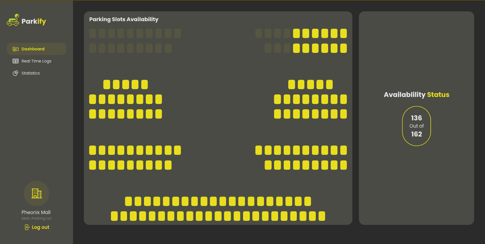
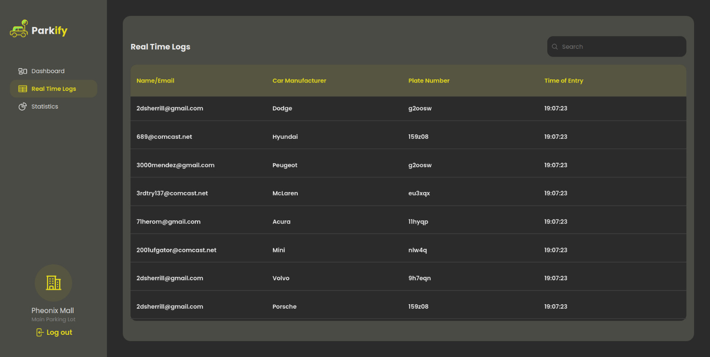
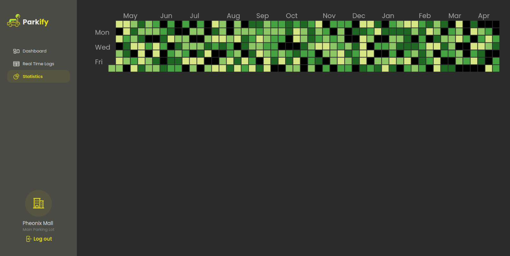
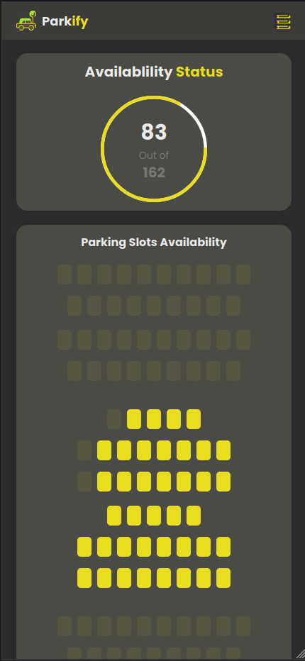
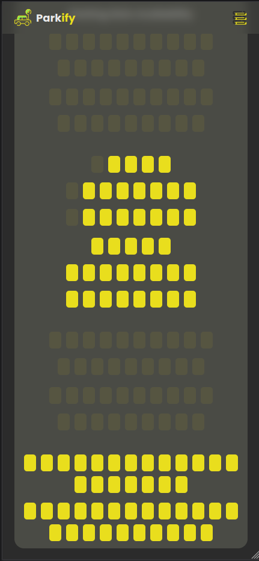
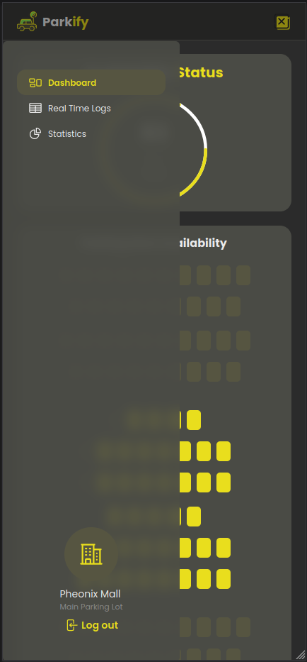
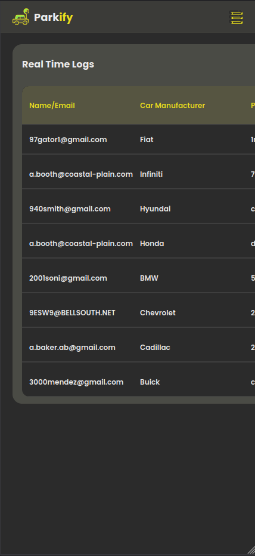
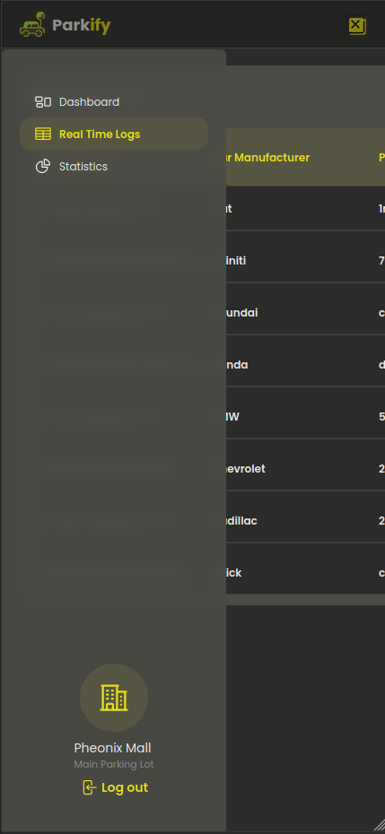

  

<h1 align="center">
   <a href="parkify.vercel.app"> parkify.vercel.app</a>
</h1>

An IoT based Smart Parking System made for the course CSE3062

  <!-- Desktop views -->
  
  
  
  
  <!-- Mobile views -->
  

    
    
    
  

  

    
    
  

## Tech Stack

- Vite
- TypeScript
- TailwindCSS
- ReactJS
- Jotai
- SocketIO
- NodeJS
- ExpressJS
- Redis

## Testing the API:

`curl -X POST -F 'file=frame.jpg' -F "entryTimeStamp=19:07:23" http://localhost:3000/api/events`

## Design Credits

- https://dribbble.com/shots/17654303-Dorsen-Parking-Dashboard

## Design

- https://cdn.dribbble.com/users/4812501/screenshots/17654303/media/63f9d8c7378c19367e44a4cde3d8420b.png?compress=1&resize=1600x1200&vertical=top
